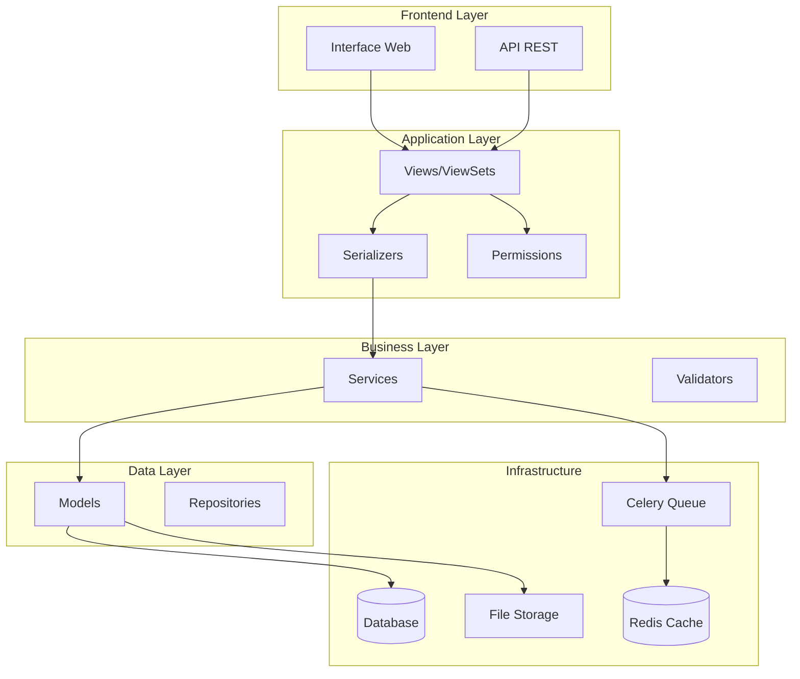
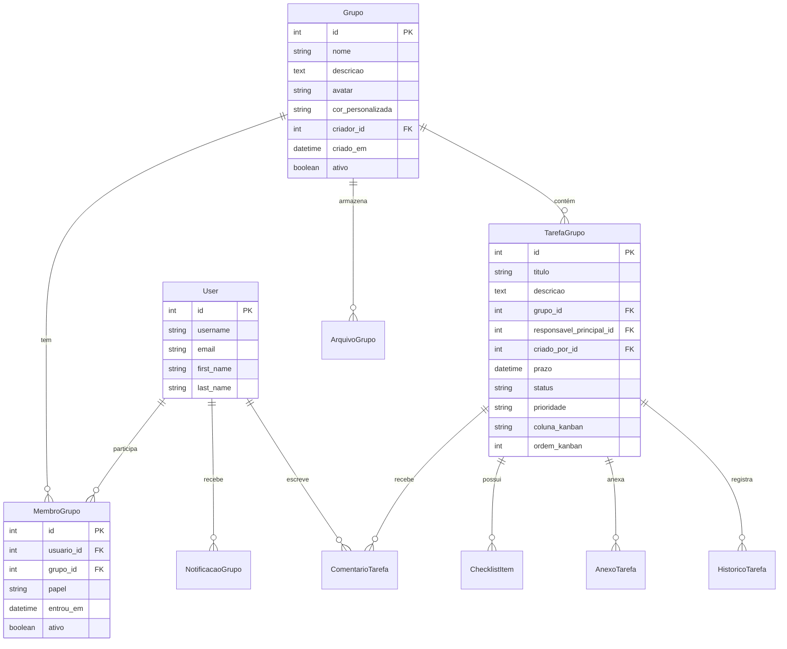

# Design Document - Módulo de Grupos Colaborativos

## Overview

O módulo de Grupos Colaborativos será implementado como uma extensão do sistema Django existente, seguindo os padrões arquiteturais já estabelecidos no projeto. A solução utilizará uma arquitetura em camadas com separação clara de responsabilidades, implementando padrões como Repository, Service Layer e Observer para notificações.

### Principais Componentes
- **Models**: Entidades de domínio com relacionamentos bem definidos
- **Services**: Lógica de negócio centralizada
- **Serializers**: Transformação de dados para API REST
- **Views**: Controllers para interface web e API
- **Permissions**: Sistema de autorização granular
- **Tasks**: Processamento assíncrono com Celery
- **WebSockets**: Comunicação em tempo real (futuro)

## Architecture

### Arquitetura Geral



### Estrutura de Diretórios

```
core/
├── models/
│   ├── __init__.py
│   ├── grupo.py
│   ├── tarefa.py
│   ├── kanban.py
│   ├── notificacao.py
│   └── arquivo.py
├── services/
│   ├── __init__.py
│   ├── grupo_service.py
│   ├── tarefa_service.py
│   ├── kanban_service.py
│   ├── notificacao_service.py
│   └── relatorio_service.py
├── serializers/
│   ├── __init__.py
│   ├── grupo_serializers.py
│   ├── tarefa_serializers.py
│   └── kanban_serializers.py
├── views/
│   ├── __init__.py
│   ├── grupo_views.py
│   ├── tarefa_views.py
│   └── kanban_views.py
├── permissions/
│   ├── __init__.py
│   └── grupo_permissions.py
├── tasks/
│   ├── __init__.py
│   ├── notificacao_tasks.py
│   └── relatorio_tasks.py
└── utils/
    ├── __init__.py
    ├── convite_utils.py
    └── arquivo_utils.py
```

## Components and Interfaces

### 1. Models (Data Layer)

#### Grupo Model
```python
class Grupo(models.Model):
    nome = models.CharField(max_length=100, unique=True)
    descricao = models.TextField()
    avatar = models.ImageField(upload_to='grupos/avatares/', null=True, blank=True)
    cor_personalizada = models.CharField(max_length=7, default='#3498db')  # HEX color
    criador = models.ForeignKey(User, on_delete=models.CASCADE, related_name='grupos_criados')
    membros = models.ManyToManyField(User, through='MembroGrupo', related_name='grupos_participando')
    ativo = models.BooleanField(default=True)
    criado_em = models.DateTimeField(auto_now_add=True)
    atualizado_em = models.DateTimeField(auto_now=True)
```

#### MembroGrupo Model (Intermediate Table)
```python
class MembroGrupo(models.Model):
    PAPEIS = [
        ('administrador', 'Administrador'),
        ('moderador', 'Moderador'),
        ('colaborador', 'Colaborador'),
    ]
    
    usuario = models.ForeignKey(User, on_delete=models.CASCADE)
    grupo = models.ForeignKey(Grupo, on_delete=models.CASCADE)
    papel = models.CharField(max_length=20, choices=PAPEIS, default='colaborador')
    entrou_em = models.DateTimeField(auto_now_add=True)
    ativo = models.BooleanField(default=True)
```

#### TarefaGrupo Model (Enhanced)
```python
class TarefaGrupo(models.Model):
    STATUS_CHOICES = [
        ('a_fazer', 'A Fazer'),
        ('em_andamento', 'Em andamento'),
        ('aguardando_feedback', 'Aguardando feedback'),
        ('concluido', 'Concluído'),
    ]
    
    PRIORIDADE_CHOICES = [
        ('baixa', 'Baixa'),
        ('media', 'Média'),
        ('alta', 'Alta'),
        ('urgente', 'Urgente'),
    ]
    
    titulo = models.CharField(max_length=200)
    descricao = models.TextField()
    grupo = models.ForeignKey(Grupo, on_delete=models.CASCADE, related_name='tarefas')
    responsavel_principal = models.ForeignKey(User, on_delete=models.SET_NULL, null=True, related_name='tarefas_responsavel')
    colaboradores = models.ManyToManyField(User, related_name='tarefas_colaborando', blank=True)
    criado_por = models.ForeignKey(User, on_delete=models.CASCADE, related_name='tarefas_grupo_criadas')
    
    prazo = models.DateTimeField(null=True, blank=True)
    status = models.CharField(max_length=20, choices=STATUS_CHOICES, default='a_fazer')
    prioridade = models.CharField(max_length=10, choices=PRIORIDADE_CHOICES, default='media')
    
    # Kanban positioning
    coluna_kanban = models.CharField(max_length=20, default='a_fazer')
    ordem_kanban = models.PositiveIntegerField(default=0)
    
    criado_em = models.DateTimeField(auto_now_add=True)
    atualizado_em = models.DateTimeField(auto_now=True)
```

#### ChecklistItem Model
```python
class ChecklistItem(models.Model):
    tarefa = models.ForeignKey(TarefaGrupo, on_delete=models.CASCADE, related_name='checklist')
    texto = models.CharField(max_length=200)
    concluido = models.BooleanField(default=False)
    ordem = models.PositiveIntegerField(default=0)
    criado_em = models.DateTimeField(auto_now_add=True)
```

### 2. Services (Business Layer)

#### GrupoService
```python
class GrupoService:
    @staticmethod
    def criar_grupo(dados_grupo, criador):
        """Cria um novo grupo com configurações padrão"""
        
    @staticmethod
    def convidar_membro(grupo, email_ou_usuario, papel, convidado_por):
        """Convida um membro por email ou adiciona usuário existente"""
        
    @staticmethod
    def gerar_link_convite(grupo, papel, validade_dias=7):
        """Gera link único de convite com token temporário"""
        
    @staticmethod
    def processar_convite_link(token):
        """Processa convite via link único"""
        
    @staticmethod
    def alterar_papel_membro(grupo, usuario, novo_papel, alterado_por):
        """Altera papel de um membro com validação de permissões"""
```

#### TarefaService
```python
class TarefaService:
    @staticmethod
    def criar_tarefa(dados_tarefa, grupo, criador):
        """Cria nova tarefa com validações e notificações"""
        
    @staticmethod
    def mover_tarefa_kanban(tarefa, nova_coluna, movido_por):
        """Move tarefa no Kanban com histórico"""
        
    @staticmethod
    def atribuir_responsavel(tarefa, novo_responsavel, atribuido_por):
        """Atribui responsável com notificação"""
        
    @staticmethod
    def adicionar_comentario(tarefa, autor, texto, mencoes=None):
        """Adiciona comentário com processamento de menções"""
```

### 3. Permissions System

#### GrupoPermissions
```python
class GrupoPermissions(BasePermission):
    def has_permission(self, request, view):
        """Verifica permissões gerais do grupo"""
        
    def has_object_permission(self, request, view, obj):
        """Verifica permissões específicas do objeto"""

class TarefaPermissions(BasePermission):
    def has_object_permission(self, request, view, obj):
        """Verifica se usuário pode acessar/modificar tarefa"""
```

### 4. API Serializers

#### GrupoSerializer
```python
class GrupoSerializer(serializers.ModelSerializer):
    membros_count = serializers.SerializerMethodField()
    tarefas_abertas = serializers.SerializerMethodField()
    papel_usuario = serializers.SerializerMethodField()
    
    class Meta:
        model = Grupo
        fields = ['id', 'nome', 'descricao', 'avatar', 'cor_personalizada', 
                 'membros_count', 'tarefas_abertas', 'papel_usuario']
```

## Data Models

### Relacionamentos Principais



### Índices de Performance

```sql
-- Índices para otimização de consultas frequentes
CREATE INDEX idx_grupo_ativo ON core_grupo(ativo);
CREATE INDEX idx_membro_grupo_ativo ON core_membrogrupo(grupo_id, ativo);
CREATE INDEX idx_tarefa_status_prazo ON core_tarefagrupo(status, prazo);
CREATE INDEX idx_tarefa_grupo_status ON core_tarefagrupo(grupo_id, status);
CREATE INDEX idx_notificacao_usuario_lida ON core_notificacaogrupo(usuario_id, lida);
```

## Error Handling

### Estratégia de Tratamento de Erros

#### 1. Validação de Dados
```python
class GrupoValidator:
    @staticmethod
    def validar_nome_unico(nome, grupo_id=None):
        """Valida se nome do grupo é único"""
        
    @staticmethod
    def validar_permissao_papel(usuario_solicitante, papel_alvo):
        """Valida se usuário pode atribuir determinado papel"""
```

#### 2. Exceções Customizadas
```python
class GrupoException(Exception):
    """Exceção base para operações de grupo"""
    pass

class PermissaoNegadaException(GrupoException):
    """Usuário não tem permissão para a operação"""
    pass

class GrupoNaoEncontradoException(GrupoException):
    """Grupo não encontrado"""
    pass
```

#### 3. Response Handlers
```python
class APIErrorHandler:
    @staticmethod
    def handle_grupo_exception(exception):
        """Converte exceções de grupo em responses HTTP apropriadas"""
        return Response({
            'error': str(exception),
            'code': exception.__class__.__name__
        }, status=status.HTTP_400_BAD_REQUEST)
```

## Testing Strategy

### 1. Testes Unitários

#### Models Tests
```python
class GrupoModelTest(TestCase):
    def test_criar_grupo_com_dados_validos(self):
        """Testa criação de grupo com dados válidos"""
        
    def test_validacao_nome_unico(self):
        """Testa validação de nome único"""
        
    def test_relacionamento_membros(self):
        """Testa relacionamento many-to-many com usuários"""
```

#### Services Tests
```python
class GrupoServiceTest(TestCase):
    def test_convidar_membro_por_email(self):
        """Testa convite de membro por email"""
        
    def test_gerar_link_convite(self):
        """Testa geração de link de convite"""
        
    def test_alterar_papel_com_permissao(self):
        """Testa alteração de papel com permissão adequada"""
```

### 2. Testes de Integração

#### API Tests
```python
class GrupoAPITest(APITestCase):
    def test_criar_grupo_via_api(self):
        """Testa criação de grupo via API REST"""
        
    def test_listar_grupos_usuario(self):
        """Testa listagem de grupos do usuário"""
        
    def test_permissoes_acesso_grupo(self):
        """Testa permissões de acesso aos grupos"""
```

### 3. Testes de Performance

#### Load Tests
```python
class GrupoPerformanceTest(TestCase):
    def test_listagem_grupos_com_muitos_membros(self):
        """Testa performance com grupos grandes"""
        
    def test_kanban_com_muitas_tarefas(self):
        """Testa performance do Kanban com muitas tarefas"""
```

### 4. Testes E2E (Selenium)

```python
class GrupoE2ETest(StaticLiveServerTestCase):
    def test_fluxo_completo_criacao_grupo(self):
        """Testa fluxo completo de criação e uso de grupo"""
        
    def test_drag_drop_kanban(self):
        """Testa funcionalidade drag & drop do Kanban"""
```

## Performance Considerations

### 1. Otimizações de Query

#### Select Related e Prefetch Related
```python
# Otimização para listagem de grupos
grupos = Grupo.objects.select_related('criador')\
    .prefetch_related('membros', 'tarefas')\
    .filter(membros=request.user)

# Otimização para Kanban
tarefas = TarefaGrupo.objects.select_related('responsavel_principal', 'criado_por')\
    .prefetch_related('colaboradores', 'checklist', 'comentarios')\
    .filter(grupo=grupo_id)
```

#### Agregações Eficientes
```python
# Estatísticas do grupo com uma query
stats = Grupo.objects.filter(id=grupo_id).aggregate(
    total_tarefas=Count('tarefas'),
    tarefas_concluidas=Count('tarefas', filter=Q(tarefas__status='concluido')),
    tarefas_atrasadas=Count('tarefas', filter=Q(
        tarefas__prazo__lt=timezone.now(),
        tarefas__status__in=['a_fazer', 'em_andamento']
    ))
)
```

### 2. Cache Strategy

#### Redis Cache
```python
# Cache de grupos do usuário
@cache_result(timeout=300)  # 5 minutos
def get_grupos_usuario(user_id):
    return Grupo.objects.filter(membros=user_id).select_related('criador')

# Cache de estatísticas do grupo
@cache_result(timeout=600)  # 10 minutos
def get_estatisticas_grupo(grupo_id):
    return calcular_estatisticas_grupo(grupo_id)
```

### 3. Processamento Assíncrono

#### Celery Tasks
```python
@shared_task
def enviar_notificacoes_prazo():
    """Task para enviar notificações de prazo de tarefas"""
    
@shared_task
def gerar_relatorio_grupo(grupo_id, formato='pdf'):
    """Task para gerar relatórios de grupo"""
    
@shared_task
def processar_upload_arquivo(arquivo_id):
    """Task para processar upload de arquivos grandes"""
```

## Security Considerations

### 1. Autenticação e Autorização

#### Middleware de Segurança
```python
class GrupoSecurityMiddleware:
    def __init__(self, get_response):
        self.get_response = get_response
    
    def __call__(self, request):
        # Validações de segurança específicas para grupos
        response = self.get_response(request)
        return response
```

### 2. Validação de Entrada

#### Sanitização de Dados
```python
class SecureGrupoSerializer(serializers.ModelSerializer):
    nome = serializers.CharField(validators=[validate_no_html])
    descricao = serializers.CharField(validators=[validate_safe_html])
    
    def validate_nome(self, value):
        # Validações adicionais de segurança
        return bleach.clean(value)
```

### 3. Rate Limiting

```python
# Limitação de criação de grupos
@ratelimit(key='user', rate='5/h', method='POST')
def criar_grupo_view(request):
    pass

# Limitação de convites
@ratelimit(key='user', rate='20/h', method='POST')
def convidar_membro_view(request):
    pass
```

## Deployment Considerations

### 1. Migrações de Banco

```python
# Migration para criar estrutura inicial
class Migration(migrations.Migration):
    dependencies = [
        ('core', '0001_initial'),
    ]
    
    operations = [
        # Criação das tabelas com índices otimizados
        migrations.CreateModel(
            name='Grupo',
            fields=[...],
            options={
                'db_table': 'core_grupo',
                'indexes': [
                    models.Index(fields=['ativo']),
                    models.Index(fields=['criado_em']),
                ]
            }
        ),
    ]
```

### 2. Configurações de Produção

```python
# settings/production.py
CACHES = {
    'default': {
        'BACKEND': 'django_redis.cache.RedisCache',
        'LOCATION': 'redis://redis:6379/1',
        'OPTIONS': {
            'CLIENT_CLASS': 'django_redis.client.DefaultClient',
        }
    }
}

# Configurações de arquivo para produção
DEFAULT_FILE_STORAGE = 'storages.backends.s3boto3.S3Boto3Storage'
AWS_STORAGE_BUCKET_NAME = 'produtiva-arquivos'
```

### 3. Monitoramento

```python
# Métricas customizadas
import logging

logger = logging.getLogger('grupos.metrics')

def log_grupo_created(grupo):
    logger.info(f'Grupo criado: {grupo.id} por {grupo.criador.username}')

def log_tarefa_moved(tarefa, coluna_origem, coluna_destino):
    logger.info(f'Tarefa {tarefa.id} movida de {coluna_origem} para {coluna_destino}')
```